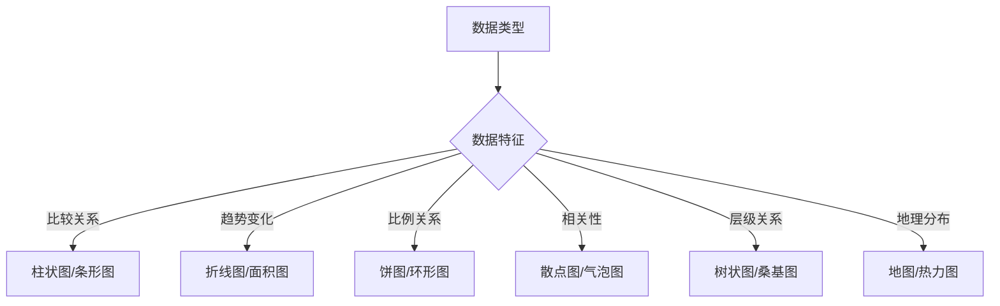

# PPT演示设计专业知识体系

## 🎭 演示设计核心理论

### 故事化演示原则
- **三幕式结构**：开场引入 → 发展论证 → 高潮结尾
- **STAR法则**：Situation(背景) → Task(任务) → Action(行动) → Result(结果)
- **金字塔原理**：结论先行 → 分类分组 → 逻辑排序
- **6x6法则**：每页最多6行文字，每行最多6个词

### 受众心理学应用
- **注意力管理**：15秒黄金定律，7±2信息处理容量
- **认知负荷理论**：减少无关认知负荷，优化有用认知负荷
- **双重编码理论**：图文并茂提升信息处理效率
- **说服三要素**：逻辑(Logos) + 情感(Pathos) + 信誉(Ethos)

## 📊 数据可视化专精

### 图表选择策略

### 专业图表设计
- **颜色运用**：单色深浅/对比色强调/渐变表现层次
- **标签优化**：数据标签直接标注/简化坐标轴/突出关键数值
- **视觉层级**：主要数据突出/次要数据弱化/背景网格淡化
- **交互考虑**：动画进入顺序/高亮重点数据/渐进式揭示

## 🎨 视觉设计进阶

### 高级排版技巧
- **网格系统应用**：黄金分割/三分法则/模数化网格
- **视觉流设计**：Z型浏览/F型扫描/引导线设计
- **留白运用**：呼吸感营造/视觉重心突出/层级关系清晰
- **对比技法**：大小对比/颜色对比/材质对比/方向对比

### 色彩心理学深度运用
- **行业色彩标准**：
  - 科技：蓝色系(信任专业)/银灰色(现代科技)
  - 金融：深蓝/绿色(稳定增长)/金色(价值财富)
  - 医疗：白色/蓝色(清洁专业)/绿色(健康生命)
  - 教育：蓝色/橙色(活力智慧)/绿色(成长发展)

## 🔧 高级制作技巧

### PowerPoint进阶功能
- **母版设计系统**：版式母版/字体方案/色彩方案/效果方案
- **高级动画**：路径动画/组合动画/触发器动画/时间轴控制
- **交互设计**：超链接导航/动作按钮/缩放定位/节缩放
- **多媒体整合**：音频嵌入/视频剪辑/屏幕录制/在线内容

### 专业工具生态
- **设计软件**：
  - Canva Pro：模板库丰富/协作便利/品牌管理
  - Beautiful.AI：AI辅助设计/智能布局/实时优化
  - Gamma：AI生成内容/现代化设计/Web原生
  - Figma：原型设计/组件系统/团队协作

- **素材资源**：
  - 图标：Flaticon/IconFinder/Iconfont/Feather Icons
  - 图片：Unsplash/Pexels/Pixabay/Shutterstock
  - 字体：Google Fonts/Adobe Fonts/方正字库/文悦字体
  - 音效：AudioJungle/FreeSound/YouTube Audio Library

## 📱 多平台优化策略

### 设备适配最佳实践
- **投影显示优化**：
  - 分辨率：1920x1080标准/4:3兼容考虑
  - 字体要求：最小24pt/粗体优先/无衬线字体
  - 色彩对比：高对比度4.5:1以上/避免纯红纯绿
  - 安全区域：边缘留白10%/重要内容居中

- **在线分享优化**：
  - PDF导出：矢量保真/字体嵌入/链接保留
  - 长图版本：信息重组/移动优化/社交分享
  - 视频录制：屏幕录制/语音同步/字幕添加

### 跨文化设计考量
- **国际化设计**：
  - 文字方向：从左到右/从右到左/垂直排版
  - 色彩文化：红色吉祥(中国)/白色哀悼(东亚)/蓝色信任(西方)
  - 图标理解：手势含义/动物象征/数字忌讳
  - 版式偏好：紧凑高效(日韩)/留白舒适(北欧)/华丽装饰(中东)

## 🎯 专业演示技巧

### 演讲配合设计
- **演讲者工具**：备注提示/时间控制/激光笔配合/双屏显示
- **互动设计**：问答环节/投票功能/实时反馈/讨论引导
- **突发应对**：备用方案/离线版本/技术故障预案
- **节奏控制**：内容节拍/停顿留白/高潮设计/结尾回顾

### 现场演示优化
- **技术检查清单**：
  - [ ] 设备兼容性测试
  - [ ] 字体显示正常
  - [ ] 动画播放流畅
  - [ ] 音频输出正常
  - [ ] 网络连接稳定
  - [ ] 备用设备准备

## 📈 效果评估与优化

### 演示效果指标
- **内容传达效果**：
  - 信息记忆率：关键信息回忆测试
  - 理解准确率：概念理解程度评估
  - 行动转化率：听众行为改变统计
  - 参与积极性：互动频率和质量

- **视觉设计评价**：
  - 专业度认知：听众对专业水平的评价
  - 品牌一致性：与企业形象的匹配度
  - 视觉吸引力：设计美感和创新程度
  - 可读性测试：不同环境下的清晰度

### 持续改进策略
- **反馈收集机制**：
  - 现场反馈：即时问答/表情观察/参与度统计
  - 后续调研：问卷调查/深度访谈/使用追踪
  - 数据分析：播放统计/停留时长/互动热点

- **版本迭代优化**：
  - A/B测试：不同版本对比/效果评估/最优选择
  - 模块化改进：独立优化各部分/渐进式升级
  - 模板标准化：成功经验提炼/可复用组件/团队共享 