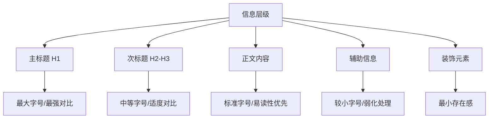

# 视觉传达知识体系

## 🎨 视觉传达基础理论

### 视觉感知原理
- **视觉层级构建**：
  - 大小对比：重要信息放大突出
  - 颜色权重：暖色前进/冷色后退/高饱和度吸引注意
  - 位置影响：左上角优先/对角线动感/中心稳定
  - 空间关系：前景突出/背景衬托/中景过渡

- **认知心理学应用**：
  - 格式塔原理：整体性/相似性/接近性/连续性/闭合性
  - 认知负荷理论：内在负荷/外在负荷/关联负荷的平衡
  - 双重编码理论：文字和图像双通道信息处理
  - 注意力经济：稀缺注意力的有效分配

### 符号学与信息设计
- **符号三要素**：
  - 符号载体：视觉形式的物理表现
  - 符号对象：所指代的实际内容
  - 符号解释：受众的理解和反应

- **信息传达模型**：
  ```mermaid
  graph LR
      A[信息源] --> B[编码设计]
      B --> C[传达媒介]
      C --> D[解码理解]
      D --> E[反馈回路]
      E --> A
  ```

## 🌈 色彩系统深度应用

### 色彩理论体系
- **色彩模式对比**：
  - RGB模式：屏幕显示/光学三原色/加色模式
  - CMYK模式：印刷输出/颜料四色/减色模式
  - HSB模式：设计思维/色相饱和度明度/直观调节
  - Lab模式：设备无关/感知均匀/专业校色

### 情感色彩设计
- **色彩心理效应**：
  - 红色：激情/紧急/行动/警告/中国吉祥
  - 蓝色：信任/专业/冷静/科技/企业首选
  - 绿色：自然/健康/安全/成长/环保意识
  - 黄色：活力/创新/注意/温暖/亲和友好
  - 紫色：高贵/神秘/创意/奢华/艺术气质
  - 橙色：热情/活跃/年轻/食欲/社交媒体

- **文化色彩差异**：
  - 东方文化：红色吉祥/金色富贵/白色哀悼
  - 西方文化：白色纯洁/黑色正式/蓝色信任
  - 宗教象征：佛教金黄/基督教白色/伊斯兰教绿色

## 📝 字体设计与信息层级

### 字体分类与应用
- **字体类型特征**：
  - 衬线字体：Times/Georgia/宋体 → 传统正式/阅读友好
  - 无衬线字体：Helvetica/Arial/微软雅黑 → 现代简洁/屏幕友好
  - 等宽字体：Courier/Monaco/Source Code → 代码显示/数据对齐
  - 装饰字体：手写体/艺术字/设计字体 → 个性表达/氛围营造

### 信息层级设计原则


## 🖼️ 图像与视觉元素

### 图像选择与处理
- **图像类型应用**：
  - 摄影图片：真实感/情感连接/场景还原
  - 矢量插画：风格统一/可缩放/品牌一致
  - 图标系统：功能指示/快速识别/国际通用
  - 数据图表：信息可视化/逻辑清晰/对比鲜明

- **图像处理技巧**：
  - 裁剪构图：三分法则/黄金比例/视觉重心
  - 色彩调整：色调统一/对比增强/氛围营造
  - 滤镜效果：风格统一/品牌调性/视觉识别
  - 蒙版应用：焦点突出/层次丰富/空间感强

### 图标设计系统
- **图标设计原则**：
  - 识别性：一眼能理解含义
  - 一致性：风格线条粗细统一
  - 简洁性：去除多余装饰元素
  - 可扩展：不同尺寸清晰显示

- **图标风格类型**：
  - 线性图标：现代简洁/适合界面
  - 面性图标：醒目突出/适合按钮
  - 渐变图标：时尚潮流/品牌个性
  - 手绘图标：亲和友好/创意表达

## 📐 版式设计与空间构成

### 网格系统应用
- **经典网格类型**：
  - 手稿网格：基础对齐/边距统一
  - 列网格：内容分栏/信息组织
  - 模块网格：区域划分/功能分组
  - 层级网格：复杂布局/灵活应用

### 空间构成原理
- **留白运用策略**：
  - 微留白：文字间距/行距/元素间距
  - 宏留白：区块间距/页面边距/视觉呼吸
  - 积极留白：有意的空间设计
  - 消极留白：元素间的自然间距

- **视觉重量平衡**：
  ```mermaid
  graph LR
      A[视觉重量] --> B[大小权重]
      A --> C[颜色权重]
      A --> D[位置权重]
      A --> E[质感权重]
      
      B --> B1[面积越大权重越重]
      C --> C1[暖色高饱和度权重重]
      D --> D1[上方左侧权重重]
      E --> E1[粗糙复杂质感权重重]
  ```

## 🎯 品牌视觉一致性

### 品牌识别系统
- **VI系统核心要素**：
  - 标志设计：品牌符号/形状记忆/识别核心
  - 标准色彩：主色调/辅助色/功能色彩
  - 标准字体：主字体/辅助字体/装饰字体
  - 应用规范：使用标准/禁用情况/变体规则

### 跨媒介一致性设计
- **多平台适配策略**：
  - 网页端：响应式适配/交互一致/加载优化
  - 移动端：触控友好/一键操作/垂直优先
  - 印刷品：色彩准确/分辨率足够/材质考虑
  - 演示文稿：投影优化/远距离可读/动效适度

- **一致性维度控制**：
  - 视觉一致：色彩/字体/图形风格统一
  - 交互一致：操作逻辑/反馈方式/流程一致
  - 内容一致：信息架构/表达方式/价值传递
  - 情感一致：品牌调性/用户感受/体验目标

## 🔄 动效与交互视觉

### 动效设计原理
- **动画缓动函数**：
  - Linear：匀速运动/机械感强
  - Ease-in：加速进入/注意力聚集
  - Ease-out：减速结束/自然停止
  - Ease-in-out：先加速后减速/最自然

### 微交互设计
- **状态反馈设计**：
  - 悬停状态：预览即将发生的操作
  - 激活状态：正在执行的操作反馈
  - 加载状态：进度指示和等待提示
  - 完成状态：操作结果的确认反馈

- **转场动画应用**：
  - 页面转换：平滑过渡/空间感知/连续体验
  - 内容展示：渐进显示/引导注意/层次揭示
  - 数据变化：数值动画/图表动效/状态切换
  - 用户引导：操作提示/功能介绍/流程指引

## 📊 数据可视化设计

### 图表美学原则
- **视觉简化**：
  - 减少图表垃圾：不必要的网格/装饰/特效
  - 突出数据：降低非数据元素的视觉权重
  - 提高数据密度：在有限空间展示更多信息
  - 保持比例：避免误导性的视觉比例

### 色彩在数据中的应用
- **功能性色彩**：
  - 分类色彩：区分不同类别/保持对比
  - 序列色彩：表示数值大小/渐变过渡
  - 发散色彩：正负值对比/双向数据
  - 强调色彩：突出重点数据/异常值标识

## 🌍 国际化设计考虑

### 多语言设计适配
- **文字长度变化**：
  - 英文→中文：通常缩短30-50%
  - 英文→德文：可能增长30-40%
  - 英文→阿拉伯语：从右到左阅读
  - 弹性布局：适应不同文字长度

### 文化敏感性设计
- **图像符号适配**：
  - 手势含义：OK手势在某些文化中是侮辱
  - 动物象征：猪在伊斯兰文化中需避免
  - 数字忌讳：4在东亚文化中不吉利
  - 颜色禁忌：白色在东方文化中与丧葬相关

这些知识体系将帮助设计师创造出既美观又有效的视觉传达作品，实现跨平台、跨文化的成功设计。 